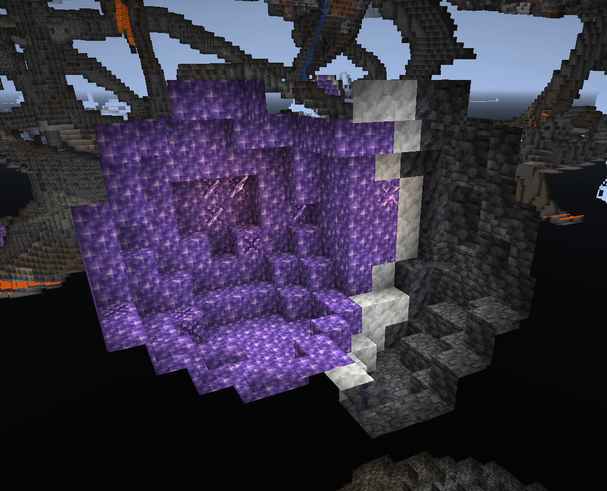
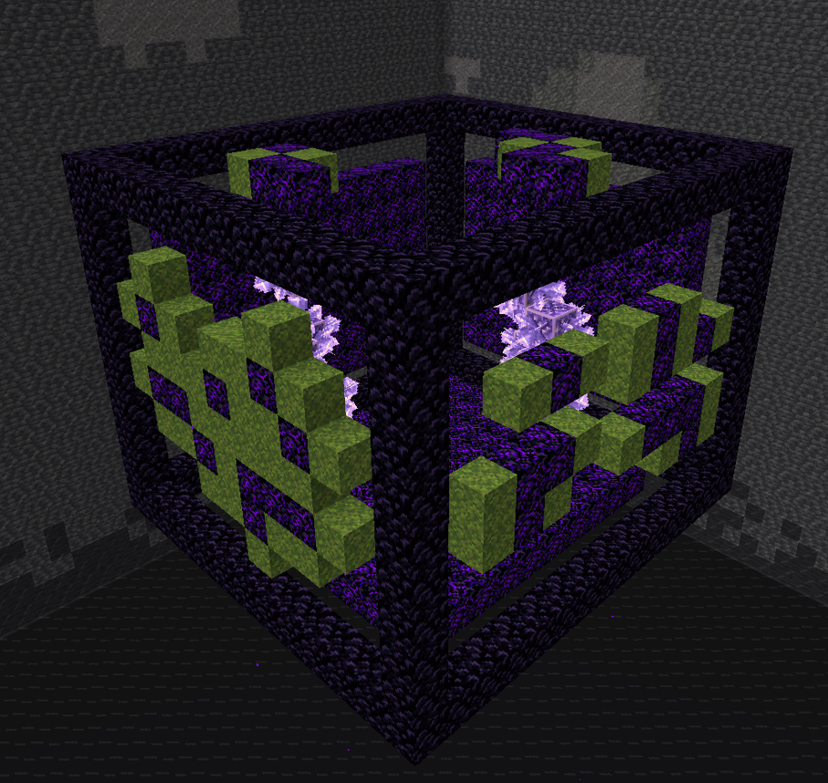
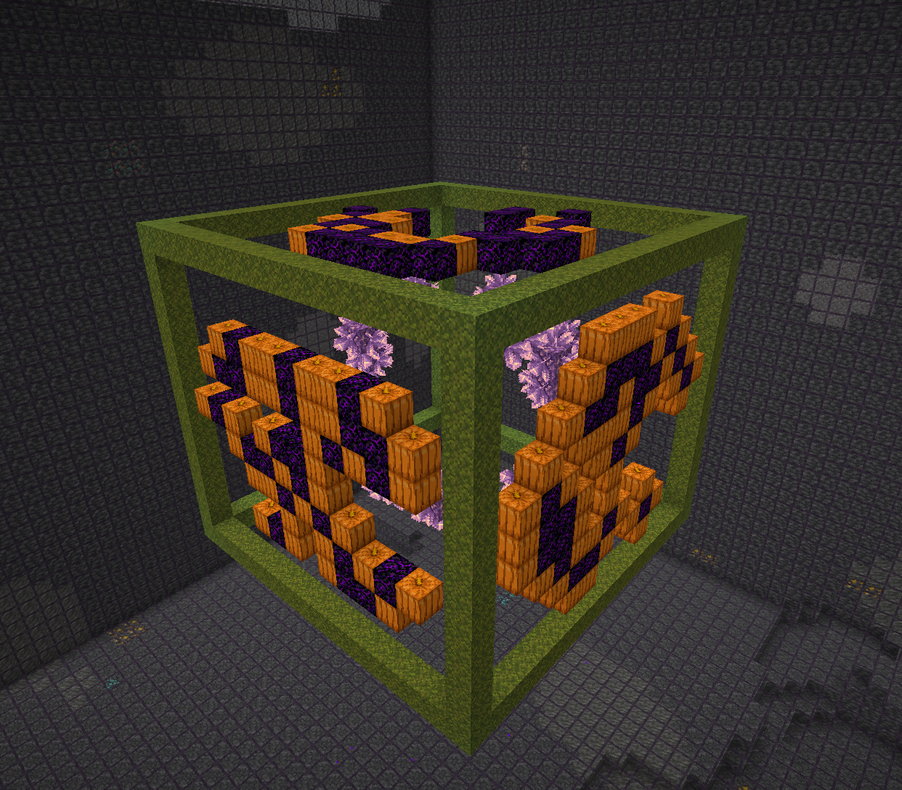
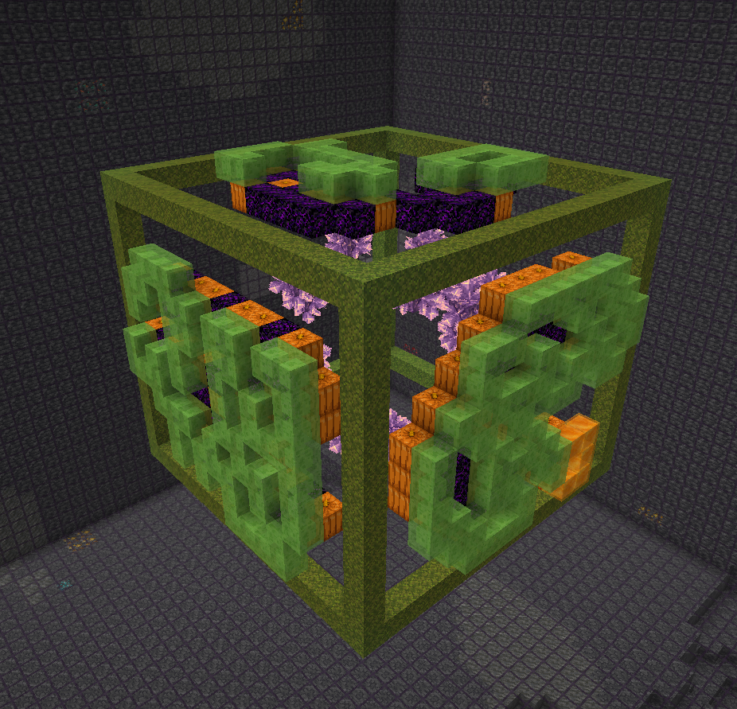

# Geodesy

Small Fabric mod for calculating amethyst farm flying machine layout.
Inspired by [ilmango's video](https://www.youtube.com/watch?v=fY90xF3ug84) and
the flying machine based farm made by neffty87.

## Usage

You should only run this in disposable worlds, either in single player or on servers
where you have op. Command blocks must also be enabled.

**The mod *will* destroy the immediate surroundings of the geode!**

1. Scout out a nice geode. For our tutorial. This small one will do.

   

2. Run `/geodesy area <first corner> <second corner>` to clear out the surrounding
   area of any junk and calculate the geode area. The area will be highlighted for you
   to verify you've entered correct coordinates.

   You don't have to be exact with the corner coordinates - you can select a larger
   volume and the mod will find the geode anyway. The only time you have to be careful
   is when you have two geodes very close to each other (this is also the reason we don't
   have autodetection - it easily got confused with multiple geodes nearby).

   

   `/geodesy area 255 -31 -1477 283 -53 -1453`

3. Run `/geodesy build <directions>` to project the geode onto three planes and create
   the farm structure:

   * Moss block means this location contains amethyst clusters to be pushed and destroyed.
   * Crying obsidian block means this location contains budding amethyst blocks, so
     the flying machine must not fly through that location.
   * Obsidian marks the outer frame of the machine.

   

   `/geodesy project south east up`

3. Place the slime and honey blocks outside the structure, as shown by ilmango. All moss
   blocks should be covered; no crying obsidian blocks should be covered.

   

4. Using black and red stained glass, place markers to indicate where the flying machines
   should go. Again, use ilmango's video for details on the L-shape they require.

   

5. Run `/geodesy assemble` to "push" the sticky block structures inside the obsidian frame
   and generate flying machines at locations that you marked.

   

6. The rest is up to you! Add trigger wiring, collection system, and redstone clock. Again,
   watch ilmango's video for more information.

## Authors

This mod was written by Kosma Moczek <kosma@kosma.pl>. The original concept of flying machine
farm is by neffty87. The flying machine design is by ilmango.
