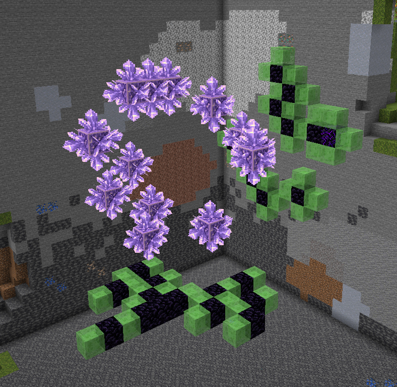

# Geodesy

Small Fabric mod for calculating amethyst farm flying machine layout.
Inspired by [ilmango's video](https://youtu.be/c8iVfBqYx90?t=690) and
the flying machine based farm made by neffty87.

## Usage

You should only run this in disposable worlds, either in single player or on servers
where you have op. The mod *will* destroy the immediate surroundings of the geode!

Run `/geodesy <geode center coordinates> <primary axis> <secondary axis>`, e.g.
`/geodesy ~ ~ ~ z x`. The entire area around you will be cleared, and two walls
of blocks will be created. In each wall:

* Slime block means this location contains amethyst clusters to be pushed and destroyed.
* Obsidian block means this location contains budding amethyst blocks, so the flying
  machine must not fly through that location.
* Crying obsidian is same as obsidian, except indicates a possible inefficiency due
  to budding amethyst layout.

Building the required flying machines is left as an exercise for the reader. (:

